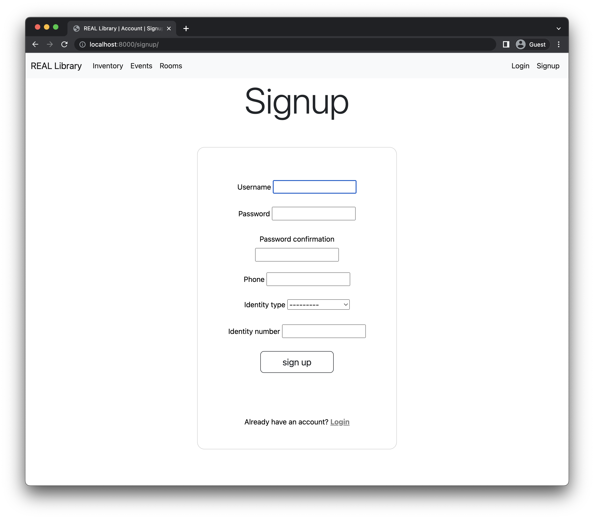

# CS-GY 6083 B - Principles of Database Systems Report for Project Part II

- Section: B
- Date: December 15, 2022
- Participants:

  - Junda Ai, net ID ja4426
  - Jayant Raj, net ID jr5993
  - Yuyang Liu, net ID yl8019

## Table of Contents

- [CS-GY 6083 B - Principles of Database Systems Report for Project Part II](#cs-gy-6083-b---principles-of-database-systems-report-for-project-part-ii)
  - [Table of Contents](#table-of-contents)
  - [Executive Summary](#executive-summary)
  - [Tech Stack](#tech-stack)
  - [DDL File Content](#ddl-file-content)
  - [List of Tables](#list-of-tables)
  - [Screenshots](#screenshots)
  - [Security Features](#security-features)
  - [Lesson Learned](#lesson-learned)
  - [Business Analysis with Project Data](#business-analysis-with-project-data)
  - [Extra Features](#extra-features)

## Executive Summary

The goal of this project is to build a web-based user interface for the database schema designed in Part I, which models a library management system that provide three main services to the customer:

- An inventory for book rental
- A events management system for exhibitions and seminars
- A rooms management system for group study room reservation

In addition to the services mentioned above the library would also allow customers to signup and login to their account and manage access authorizations of different groups of users.

## Tech Stack

Given the tight deadline and short of stuff Junda decided to use the Django framework in the Python programming language to facilitate rapid prototyping of the application, and the Bootstrap framework to style the HTML pages.

Django is a full stack web framework that provides an ORM (Object Relational Mapper) to interact with the database, a templating engine to render the HTML pages, and a web server to serve the pages. The ORM is a layer that sits between the application and the database and provides a high level interface to interact with the database. The templating engine is a layer that sits between the application and the web server and provides a high level interface to render the HTML pages. The web server is a layer that sits between the application and the client and provides a high level interface to serve the pages. Django also comes with an admin page to conveniently manage database models out of the box as well as some Bootstrap provides a set of CSS classes to plug-and-play with the HTML pages.

## DDL File Content

```sql
-- SQLINES DEMO *** le SQL Developer Data Modeler 22.2.0.165.1149
-- SQLINES DEMO *** -11-05 15:10:28 EDT
-- SQLINES DEMO *** le Database 21c
-- SQLINES DEMO *** le Database 21c


-- SQLINES DEMO *** no DDL - MDSYS.SDO_GEOMETRY

-- SQLINES DEMO *** no DDL - XMLTYPE

-- SQLINES LICENSE FOR EVALUATION USE ONLY
CREATE TABLE author (
    auth_id INT NOT NULL COMMENT 'AUTHOR ID',
    fname   VARCHAR(30) NOT NULL COMMENT 'First name',
    lname   VARCHAR(30) NOT NULL COMMENT 'Last name',
    email   VARCHAR(50) NOT NULL COMMENT 'Author''s email',
    street  VARCHAR(30) NOT NULL COMMENT 'Street address',
    city    VARCHAR(30) NOT NULL COMMENT 'Author''s city',
    state   VARCHAR(2) NOT NULL COMMENT 'Author''s state code',
    zip     INT NOT NULL COMMENT 'Author''s zip code'
);

/* Moved to CREATE TABLE
COMMENT ON COLUMN author.auth_id IS
    'AUTHOR ID'; */

/* Moved to CREATE TABLE
COMMENT ON COLUMN author.fname IS
    'First name'; */

/* Moved to CREATE TABLE
COMMENT ON COLUMN author.lname IS
    'Last name'; */

/* Moved to CREATE TABLE
COMMENT ON COLUMN author.email IS
    'Author''s email'; */

/* Moved to CREATE TABLE
COMMENT ON COLUMN author.street IS
    'Street address'; */

/* Moved to CREATE TABLE
COMMENT ON COLUMN author.city IS
    'Author''s city'; */

/* Moved to CREATE TABLE
COMMENT ON COLUMN author.state IS
    'Author''s state code'; */

/* Moved to CREATE TABLE
COMMENT ON COLUMN author.zip IS
    'Author''s zip code'; */

ALTER TABLE author ADD CONSTRAINT author_pk PRIMARY KEY ( auth_id );

-- SQLINES LICENSE FOR EVALUATION USE ONLY
CREATE TABLE author_seminar (
    inv_id  INT NOT NULL COMMENT 'Invitation ID',
    auth_id INT NOT NULL,
    e_id    INT NOT NULL
);

/* Moved to CREATE TABLE
COMMENT ON COLUMN author_seminar.inv_id IS
    'Invitation ID'; */

ALTER TABLE author_seminar
    ADD CONSTRAINT author_seminar_pk PRIMARY KEY ( inv_id,
                                                   auth_id,
                                                   e_id );

-- SQLINES LICENSE FOR EVALUATION USE ONLY
CREATE TABLE book (
    book_id  INT NOT NULL COMMENT 'Book ID',
    name     VARCHAR(50) NOT NULL COMMENT 'Book''s name',
    topic_id SMALLINT NOT NULL
);

/* Moved to CREATE TABLE
COMMENT ON COLUMN book.book_id IS
    'Book ID'; */

/* Moved to CREATE TABLE
COMMENT ON COLUMN book.name IS
    'Book''s name'; */

ALTER TABLE book ADD CONSTRAINT book_pk PRIMARY KEY ( book_id );

-- SQLINES LICENSE FOR EVALUATION USE ONLY
CREATE TABLE book_author (
    auth_id INT NOT NULL,
    book_id INT NOT NULL
);

ALTER TABLE book_author ADD CONSTRAINT book_author_pk PRIMARY KEY ( book_id,
                                                                    auth_id );

-- SQLINES LICENSE FOR EVALUATION USE ONLY
CREATE TABLE copy (
    copy_id BIGINT NOT NULL COMMENT 'Unique Copy ID for a book',
    status  CHAR(1) NOT NULL COMMENT 'Status of copy - A for available, R for on rent',
    book_id INT NOT NULL
);

/* Moved to CREATE TABLE
COMMENT ON COLUMN copy.copy_id IS
    'Unique Copy ID for a book'; */

/* Moved to CREATE TABLE
COMMENT ON COLUMN copy.status IS
    'Status of copy - A for available, R for on rent'; */

ALTER TABLE copy ADD CONSTRAINT copy_pk PRIMARY KEY ( copy_id );

-- SQLINES LICENSE FOR EVALUATION USE ONLY
CREATE TABLE customer (
    cust_id   BIGINT NOT NULL COMMENT 'Customer ID',
    fname     VARCHAR(30) NOT NULL COMMENT 'First name',
    lname     VARCHAR(30) NOT NULL,
    phone     VARCHAR(13) NOT NULL COMMENT 'Customer''s phone number',
    email     VARCHAR(50) NOT NULL COMMENT 'Customer''s email',
    id_type   CHAR(1) NOT NULL COMMENT 'Identification type - one of passport (P), SSN (S) or driver''s license (D)',
    id_number VARCHAR(15) NOT NULL COMMENT 'ID_NUMBER (can be alphanumeric) from passport, SSN-driver''s license.'
);

/* Moved to CREATE TABLE
COMMENT ON COLUMN customer.cust_id IS
    'Customer ID'; */

/* Moved to CREATE TABLE
COMMENT ON COLUMN customer.fname IS
    'First name'; */

/* Moved to CREATE TABLE
COMMENT ON COLUMN customer.phone IS
    'Customer''s phone number'; */

/* Moved to CREATE TABLE
COMMENT ON COLUMN customer.email IS
    'Customer''s email'; */

/* Moved to CREATE TABLE
COMMENT ON COLUMN customer.id_type IS
    'Identification type - one of passport (P), SSN (S) or driver''s license (D)'; */

/* Moved to CREATE TABLE
COMMENT ON COLUMN customer.id_number IS
    'ID_NUMBER (can be alphanumeric) from passport, SSN-driver''s license.'; */

ALTER TABLE customer ADD CONSTRAINT customer_pk PRIMARY KEY ( cust_id );

-- SQLINES LICENSE FOR EVALUATION USE ONLY
CREATE TABLE customer_exhibition (
    reg_id  INT NOT NULL COMMENT 'Registration ID or invitation ID depending on whether the customer is an author participating in seminar or in exhibition.',
    cust_id BIGINT NOT NULL,
    e_id    DOUBLE NOT NULL
);

/* Moved to CREATE TABLE
COMMENT ON COLUMN customer_exhibition.reg_id IS
    'Registration ID or invitation ID depending on whether the customer is an author participating in seminar or in exhibition.'; */

ALTER TABLE customer_exhibition
    ADD CONSTRAINT customer_exhibition_pk PRIMARY KEY ( reg_id,
                                                        cust_id,
                                                        e_id );

-- SQLINES LICENSE FOR EVALUATION USE ONLY
CREATE TABLE customer_room (
    day_booked DATETIME NOT NULL COMMENT 'Day the room is booked',
    timeslot   TINYINT NOT NULL COMMENT 'Timeslot the room is booked - one of four, with ''1'' for 8-10AM, ''2'' for 11am-1pm, ''3'' for 1-3pm and ''4'' for 4-6pm.',
    cust_id    BIGINT NOT NULL,
    room_id    SMALLINT NOT NULL
);

/* Moved to CREATE TABLE
COMMENT ON COLUMN customer_room.day_booked IS
    'Day the room is booked'; */

/* Moved to CREATE TABLE
COMMENT ON COLUMN customer_room.timeslot IS
    'Timeslot the room is booked - one of four, with ''1'' for 8-10AM, ''2'' for 11am-1pm, ''3'' for 1-3pm and ''4'' for 4-6pm.'; */

ALTER TABLE customer_room ADD CONSTRAINT customer_room_pk PRIMARY KEY ( room_id,
                                                                        cust_id );

-- SQLINES LICENSE FOR EVALUATION USE ONLY
CREATE TABLE event (
    e_id       INT NOT NULL COMMENT 'Unique Event ID',
    name       VARCHAR(30) NOT NULL COMMENT 'Event''s name',
    type       VARCHAR(10) NOT NULL COMMENT 'Event type - can either be Seminar or Exhibition',
    start_time DATETIME NOT NULL COMMENT 'Start datetime',
    stop_time  DATETIME NOT NULL COMMENT 'Stop datetime',
    topic_id   SMALLINT
);

ALTER TABLE event
    ADD CONSTRAINT ch_inh_event CHECK ( type IN ( 'Exhibition', 'Seminar' ) );

/* Moved to CREATE TABLE
COMMENT ON COLUMN event.e_id IS
    'Unique Event ID'; */

/* Moved to CREATE TABLE
COMMENT ON COLUMN event.name IS
    'Event''s name'; */

/* Moved to CREATE TABLE
COMMENT ON COLUMN event.type IS
    'Event type - can either be Seminar or Exhibition'; */

/* Moved to CREATE TABLE
COMMENT ON COLUMN event.start_time IS
    'Start datetime'; */

/* Moved to CREATE TABLE
COMMENT ON COLUMN event.stop_time IS
    'Stop datetime'; */

ALTER TABLE event ADD CONSTRAINT event_pk PRIMARY KEY ( e_id );

-- SQLINES LICENSE FOR EVALUATION USE ONLY
CREATE TABLE exhibition (
    e_id     INT NOT NULL COMMENT 'Unique Event ID',
    expenses DECIMAL(8, 2) NOT NULL COMMENT 'Exhibition expenses'
);

/* Moved to CREATE TABLE
COMMENT ON COLUMN exhibition.e_id IS
    'Unique Event ID'; */

/* Moved to CREATE TABLE
COMMENT ON COLUMN exhibition.expenses IS
    'Exhibition expenses'; */

ALTER TABLE exhibition ADD CONSTRAINT exhibition_pk PRIMARY KEY ( e_id );

-- SQLINES LICENSE FOR EVALUATION USE ONLY
CREATE TABLE invoice (
    invoice_id BIGINT NOT NULL COMMENT 'Invoice ID',
    inv_date   DATETIME NOT NULL COMMENT 'Date the invoice is generated',
    inv_amt    DECIMAL(8, 2) NOT NULL COMMENT 'Invoice amount (calculated based on formula).',
    rent_id    INT NOT NULL
);

/* Moved to CREATE TABLE
COMMENT ON COLUMN invoice.invoice_id IS
    'Invoice ID'; */

/* Moved to CREATE TABLE
COMMENT ON COLUMN invoice.inv_date IS
    'Date the invoice is generated'; */

/* Moved to CREATE TABLE
COMMENT ON COLUMN invoice.inv_amt IS
    'Invoice amount (calculated based on formula).'; */

-- SQLINES LICENSE FOR EVALUATION USE ONLY
CREATE UNIQUE INDEX invoice__idx ON
    invoice (
        rent_id
    ASC );

ALTER TABLE invoice ADD CONSTRAINT invoice_pk PRIMARY KEY ( invoice_id );

-- SQLINES LICENSE FOR EVALUATION USE ONLY
CREATE TABLE payment (
    pay_id     BIGINT NOT NULL COMMENT 'Unique Payment ID for paying a part (or full) of that invoice',
    pay_date   DATETIME NOT NULL COMMENT 'Date payment is done',
    pay_method CHAR(2) NOT NULL COMMENT 'Payment method - ''P'' for PayPal, ''CC'' for credit card, ''CA'' for cash and ''DC'' for debit card.',
    fname      VARCHAR(30) NOT NULL COMMENT 'Cardholder''s first name',
    lname      VARCHAR(30) NOT NULL COMMENT 'Cardholder''s last name',
    pay_amt    DECIMAL(8, 2) NOT NULL COMMENT 'Payment amount',
    invoice_id BIGINT NOT NULL
);

/* Moved to CREATE TABLE
COMMENT ON COLUMN payment.pay_id IS
    'Unique Payment ID for paying a part (or full) of that invoice'; */

/* Moved to CREATE TABLE
COMMENT ON COLUMN payment.pay_date IS
    'Date payment is done'; */

/* Moved to CREATE TABLE
COMMENT ON COLUMN payment.pay_method IS
    'Payment method - ''P'' for PayPal, ''CC'' for credit card, ''CA'' for cash and ''DC'' for debit card.'; */

/* Moved to CREATE TABLE
COMMENT ON COLUMN payment.fname IS
    'Cardholder''s first name'; */

/* Moved to CREATE TABLE
COMMENT ON COLUMN payment.lname IS
    'Cardholder''s last name'; */

/* Moved to CREATE TABLE
COMMENT ON COLUMN payment.pay_amt IS
    'Payment amount'; */

ALTER TABLE payment ADD CONSTRAINT payment_pk PRIMARY KEY ( pay_id );

-- SQLINES LICENSE FOR EVALUATION USE ONLY
CREATE TABLE rental (
    rent_id       INT NOT NULL COMMENT 'Unique rental service ID for each time a copy is borrowed',
    r_status      CHAR(1) NOT NULL COMMENT 'Rental status - ''B'' for borrowed, ''R'' for returned, ''L'' for late',
    borrow_date   DATETIME NOT NULL COMMENT 'Date borrowed',
    exp_return    DATETIME NOT NULL COMMENT 'Date the rental is expected to return',
    actual_return DATETIME NOT NULL COMMENT 'Date the rental is actually returned',
    copy_id       BIGINT
);

/* Moved to CREATE TABLE
COMMENT ON COLUMN rental.rent_id IS
    'Unique rental service ID for each time a copy is borrowed'; */

/* Moved to CREATE TABLE
COMMENT ON COLUMN rental.r_status IS
    'Rental status - ''B'' for borrowed, ''R'' for returned, ''L'' for late'; */

/* Moved to CREATE TABLE
COMMENT ON COLUMN rental.borrow_date IS
    'Date borrowed'; */

/* Moved to CREATE TABLE
COMMENT ON COLUMN rental.exp_return IS
    'Date the rental is expected to return'; */

/* Moved to CREATE TABLE
COMMENT ON COLUMN rental.actual_return IS
    'Date the rental is actually returned'; */

-- SQLINES LICENSE FOR EVALUATION USE ONLY
CREATE UNIQUE INDEX rental__idx ON
    rental (
        rent_id
    ASC );

ALTER TABLE rental ADD CONSTRAINT rental_pk PRIMARY KEY ( rent_id );

-- SQLINES LICENSE FOR EVALUATION USE ONLY
CREATE TABLE room (
    room_id       SMALLINT NOT NULL COMMENT 'Unique ID for each room',
    room_capacity TINYINT NOT NULL COMMENT 'Max capacity for each room'
);

/* Moved to CREATE TABLE
COMMENT ON COLUMN room.room_id IS
    'Unique ID for each room'; */

/* Moved to CREATE TABLE
COMMENT ON COLUMN room.room_capacity IS
    'Max capacity for each room'; */

ALTER TABLE room ADD CONSTRAINT room_pk PRIMARY KEY ( room_id );

-- SQLINES LICENSE FOR EVALUATION USE ONLY
CREATE TABLE seminar (
    e_id INT NOT NULL COMMENT 'Unique Event ID'
);

/* Moved to CREATE TABLE
COMMENT ON COLUMN seminar.e_id IS
    'Unique Event ID'; */

ALTER TABLE seminar ADD CONSTRAINT seminar_pk PRIMARY KEY ( e_id );

-- SQLINES LICENSE FOR EVALUATION USE ONLY
CREATE TABLE sponsor (
    sponsor_id INT NOT NULL COMMENT 'Unique Sponsor ID',
    fname      VARCHAR(30) NOT NULL COMMENT 'Sponsor First name if individual. Org name if org.',
    lname      VARCHAR(30) COMMENT 'Sponsor''s last name (optional)',
    type       CHAR(1) NOT NULL COMMENT 'Sponsor type. I for individual, and O for organisation.'
);

/* Moved to CREATE TABLE
COMMENT ON COLUMN sponsor.sponsor_id IS
    'Unique Sponsor ID'; */

/* Moved to CREATE TABLE
COMMENT ON COLUMN sponsor.fname IS
    'Sponsor First name if individual. Org name if org.'; */

/* Moved to CREATE TABLE
COMMENT ON COLUMN sponsor.lname IS
    'Sponsor''s last name (optional)'; */

/* Moved to CREATE TABLE
COMMENT ON COLUMN sponsor.type IS
    'Sponsor type. I for individual, and O for organisation.'; */

ALTER TABLE sponsor ADD CONSTRAINT sponsor_pk PRIMARY KEY ( sponsor_id );

-- SQLINES LICENSE FOR EVALUATION USE ONLY
CREATE TABLE sponsor_seminar (
    amt_supp   DECIMAL(8, 2) NOT NULL COMMENT 'Amount each sponsor supports for each seminar',
    sponsor_id INT NOT NULL,
    e_id       INT NOT NULL
);

/* Moved to CREATE TABLE
COMMENT ON COLUMN sponsor_seminar.amt_supp IS
    'Amount each sponsor supports for each seminar'; */

ALTER TABLE sponsor_seminar ADD CONSTRAINT sponsor_seminar_pk PRIMARY KEY ( sponsor_id,
                                                                            e_id );

-- SQLINES LICENSE FOR EVALUATION USE ONLY
CREATE TABLE topic (
    topic_id    SMALLINT NOT NULL COMMENT 'Topic ID',
    name        VARCHAR(30) NOT NULL COMMENT 'Topic name',
    description VARCHAR(100) NOT NULL COMMENT 'Topic description'
);

/* Moved to CREATE TABLE
COMMENT ON COLUMN topic.topic_id IS
    'Topic ID'; */

/* Moved to CREATE TABLE
COMMENT ON COLUMN topic.name IS
    'Topic name'; */

/* Moved to CREATE TABLE
COMMENT ON COLUMN topic.description IS
    'Topic description'; */

ALTER TABLE topic ADD CONSTRAINT topic_pk PRIMARY KEY ( topic_id );

ALTER TABLE author_seminar
    ADD CONSTRAINT author_seminar_author_fk FOREIGN KEY ( auth_id )
        REFERENCES author ( auth_id );

ALTER TABLE author_seminar
    ADD CONSTRAINT author_seminar_seminar_fk FOREIGN KEY ( e_id )
        REFERENCES seminar ( e_id );

ALTER TABLE book_author
    ADD CONSTRAINT book_author_author_fk FOREIGN KEY ( auth_id )
        REFERENCES author ( auth_id );

ALTER TABLE book_author
    ADD CONSTRAINT book_author_book_fk FOREIGN KEY ( book_id )
        REFERENCES book ( book_id );

ALTER TABLE book
    ADD CONSTRAINT book_topic_fk FOREIGN KEY ( topic_id )
        REFERENCES topic ( topic_id );

ALTER TABLE copy
    ADD CONSTRAINT copy_book_fk FOREIGN KEY ( book_id )
        REFERENCES book ( book_id );

ALTER TABLE customer_exhibition
    ADD CONSTRAINT customer_fk FOREIGN KEY ( cust_id )
        REFERENCES customer ( cust_id );

ALTER TABLE customer_room
    ADD CONSTRAINT customer_room_customer_fk FOREIGN KEY ( cust_id )
        REFERENCES customer ( cust_id );

ALTER TABLE customer_room
    ADD CONSTRAINT customer_room_room_fk FOREIGN KEY ( room_id )
        REFERENCES room ( room_id );

ALTER TABLE event
    ADD CONSTRAINT event_topic_fk FOREIGN KEY ( topic_id )
        REFERENCES topic ( topic_id );

ALTER TABLE exhibition
    ADD CONSTRAINT exhibition_event_fk FOREIGN KEY ( e_id )
        REFERENCES event ( e_id );

ALTER TABLE invoice
    ADD CONSTRAINT invoice_rental_fk FOREIGN KEY ( rent_id )
        REFERENCES rental ( rent_id );

ALTER TABLE payment
    ADD CONSTRAINT payment_invoice_fk FOREIGN KEY ( invoice_id )
        REFERENCES invoice ( invoice_id );

ALTER TABLE rental
    ADD CONSTRAINT rental_copy_fk FOREIGN KEY ( copy_id )
        REFERENCES copy ( copy_id );

ALTER TABLE seminar
    ADD CONSTRAINT seminar_event_fk FOREIGN KEY ( e_id )
        REFERENCES event ( e_id );

ALTER TABLE sponsor_seminar
    ADD CONSTRAINT sponsor_seminar_seminar_fk FOREIGN KEY ( e_id )
        REFERENCES seminar ( e_id );

ALTER TABLE sponsor_seminar
    ADD CONSTRAINT sponsor_seminar_sponsor_fk FOREIGN KEY ( sponsor_id )
        REFERENCES sponsor ( sponsor_id );

-- SQLINES LICENSE FOR EVALUATION USE ONLY
DROP TRIGGER IF EXISTS arc_fkarc_4_seminar;

DELIMITER //

CREATE TRIGGER arc_fkarc_4_seminar BEFORE
    INSERT OR UPDATE OF e_id ON seminar
    FOR EACH ROW
    DECLARE d VARCHAR(10);
BEGIN
    -- SQLINES LICENSE FOR EVALUATION USE ONLY
    SELECT
        a.type
    INTO d
    FROM
        event a
    WHERE
        a.e_id = :new.e_id;

    IF ( d IS NULL OR d <> 'Seminar' ) THEN
        raise_application_error(-20223, 'FK SEMINAR_EVENT_FK in Table SEMINAR violates Arc constraint on Table EVENT - discriminator column TYPE doesn''t have value ''Seminar'''
        );
    END IF;

    DECLARE EXIT HANDLER FOR not found BEGIN
        NULL;
    END;
    DECLARE EXIT HANDLER FOR SQLEXCEPTION BEGIN
        RESIGNAL;
    END;
END;
/

-- SQLINES LICENSE FOR EVALUATION USE ONLY
DROP TRIGGER IF EXISTS arc_fkarc_4_exhibition;

DELIMITER //

CREATE TRIGGER arc_fkarc_4_exhibition BEFORE
    INSERT OR UPDATE OF e_id ON exhibition
    FOR EACH ROW
    DECLARE d VARCHAR(10);
BEGIN
    -- SQLINES LICENSE FOR EVALUATION USE ONLY
    SELECT
        a.type
    INTO d
    FROM
        event a
    WHERE
        a.e_id = :new.e_id;

    IF ( d IS NULL OR d <> 'Exhibition' ) THEN
        raise_application_error(-20223, 'FK EXHIBITION_EVENT_FK in Table EXHIBITION violates Arc constraint on Table EVENT - discriminator column TYPE doesn''t have value ''Exhibition'''
        );
    END IF;

    DECLARE EXIT HANDLER FOR not found BEGIN
        NULL;
    END;
    DECLARE EXIT HANDLER FOR SQLEXCEPTION BEGIN
        RESIGNAL;
    END;
END;
/


-- SQLINES DEMO *** per Data Modeler Summary Report:
--
-- SQLINES DEMO ***                        18
-- SQLINES DEMO ***                         2
-- SQLINES DEMO ***                        36
-- SQLINES DEMO ***                         0
-- SQLINES DEMO ***                         0
-- SQLINES DEMO ***                         0
-- SQLINES DEMO *** DY                      0
-- SQLINES DEMO ***                         0
-- SQLINES DEMO ***                         0
-- SQLINES DEMO ***                         2
-- SQLINES DEMO ***                         0
-- SQLINES DEMO ***  TYPE                   0
-- SQLINES DEMO ***  TYPE                   0
-- SQLINES DEMO ***  TYPE BODY              0
-- SQLINES DEMO ***                         0
-- SQLINES DEMO ***                         0
-- SQLINES DEMO ***                         0
-- SQLINES DEMO ***                         0
-- SQLINES DEMO ***                         0
-- SQLINES DEMO ***                         0
-- SQLINES DEMO ***                         0
-- SQLINES DEMO *** EGMENT                  0
-- SQLINES DEMO ***                         0
-- SQLINES DEMO *** ED VIEW                 0
-- SQLINES DEMO *** ED VIEW LOG             0
-- SQLINES DEMO ***                         0
-- SQLINES DEMO ***                         0
-- SQLINES DEMO ***                         0
--
-- SQLINES DEMO ***                         0
-- SQLINES DEMO ***                         0
--
-- SQLINES DEMO ***                         0
--
-- SQLINES DEMO ***                         0
-- SQLINES DEMO *** A                       0
-- SQLINES DEMO *** T                       0
--
-- SQLINES DEMO ***                         0
-- SQLINES DEMO ***                         0

```

## List of Tables

Listed below are tables generated by the Django ORM:


## Screenshots





## Security Features

## Lesson Learned

## Business Analysis with Project Data

## Extra Features
